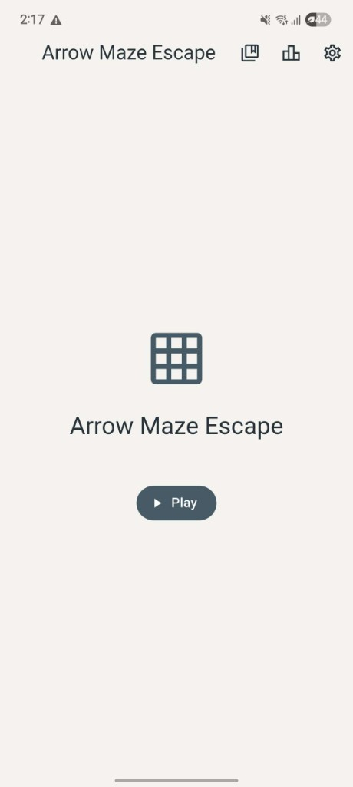
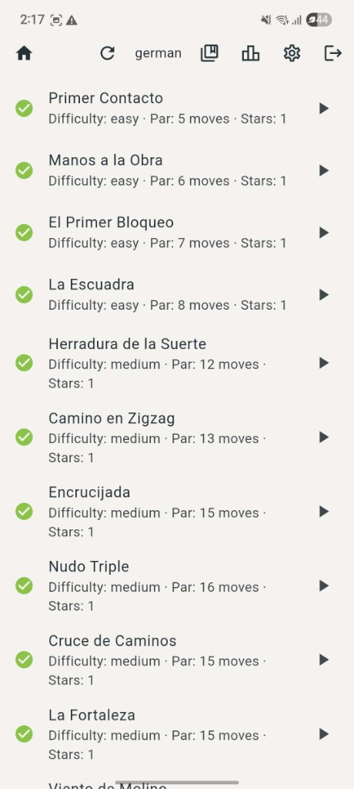
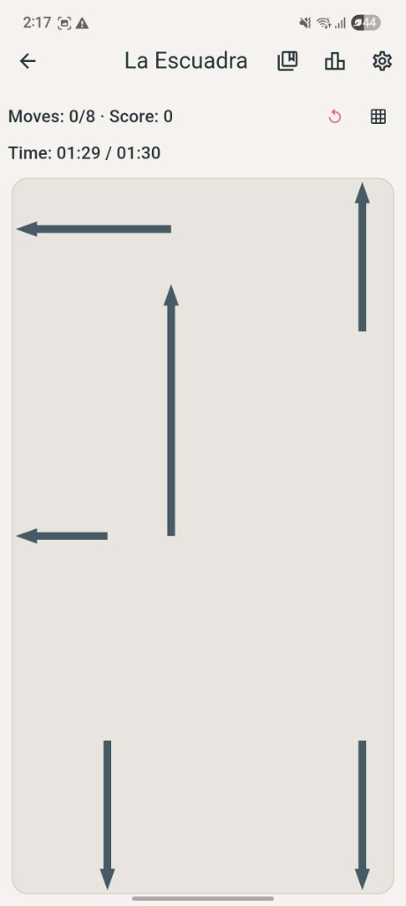
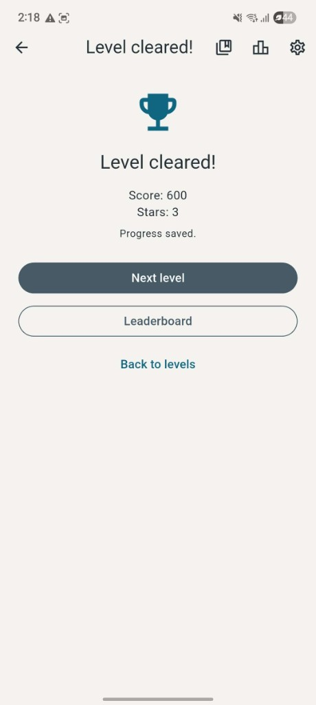
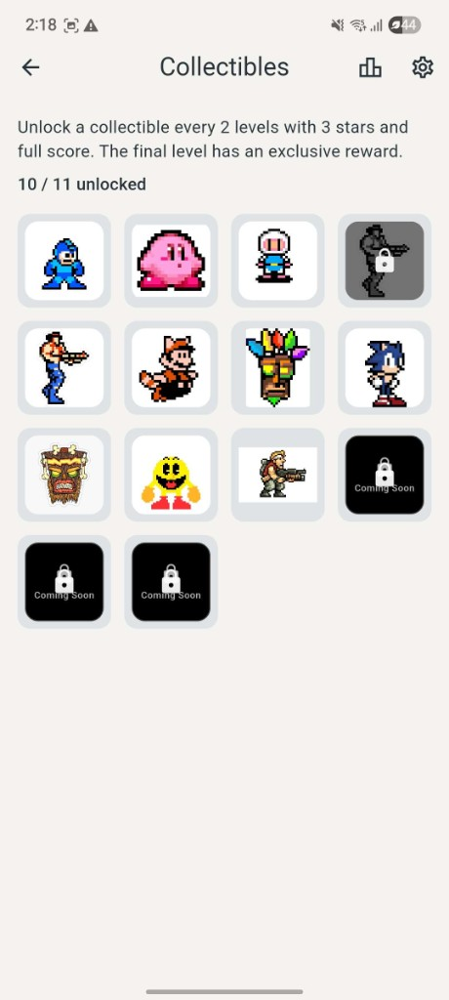
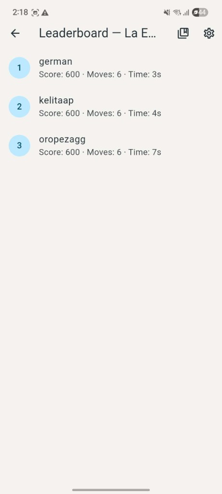
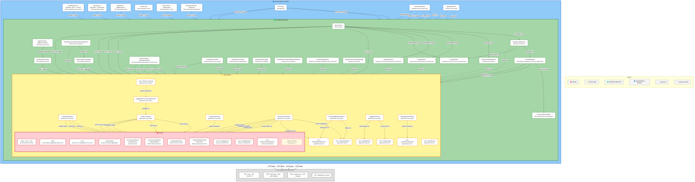
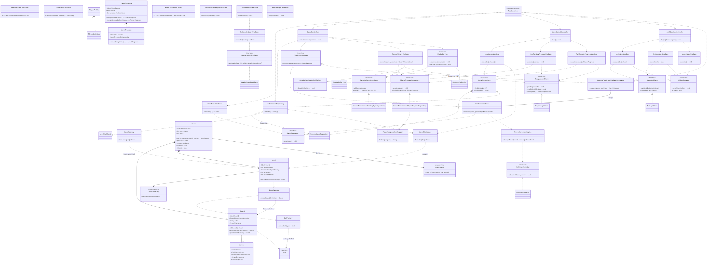

# Arrow Maze Escape Puzzle


## Description

*Arrow Maze Escape Puzzle* is a mobile puzzle game where the player extracts all the
arrows from a board by firing them in the direction they point, without colliding
with other arrows. Built with **Flutter** following **Clean Architecture** and
**SOLID** principles.

The app is fully playable end to end: home, level select (with lock/completion/star
indicators), the game board, victory/defeat screens, a collectibles gallery unlocked by
milestone-level performance, contextual sound effects (button clicks, arrow extraction,
blocked moves, level cleared, time/moves exhausted) plus background music and a
per-level countdown timer, all behind a mutable `IAudioService` port, and two languages
(English/Spanish). It authenticates against the
[BackEnd-ArrowMaze](https://github.com/Georopeza/BackEnd-ArrowMaze) API, downloads and
caches the level catalog (29 levels and growing) for offline play, and keeps player progress — including
unlocked collectibles — in sync with the server in both directions: push on victory
(with a retry queue for offline wins) and pull-and-merge on login, so progress follows
the player across devices.

## Demo / Screenshots

Screens from the Android build (Spanish UI, synced with the backend on Render):

| Screen | Description |
|--------|-------------|
| Home | Title, **Play** button, shortcuts to collectibles, leaderboard and settings |
| Level select | Catalog with completion checkmarks, difficulty, par moves and stars |
| Gameplay | Board with arrows, move/score counter and per-level countdown timer |
| Victory | Score, stars earned, progress saved, next level / leaderboard actions |
| Collectibles | Gallery unlocked every 2 levels with 3 stars; exclusive final-level reward |
| Leaderboard | Global ranking per level (score, moves, time) |

<p align="center">
  
  
  
</p>
<p align="center">
  
  
  
</p>

## Architecture

Four **concentric** Clean Architecture layers (onion model, L4⊃L3⊃L2⊃L1): **DOMAIN** at the
center; each outer ring may depend on inner rings only — never the reverse. Ports
(`I*Repository`, `I*ApiClient`, `IAudioService`) live in domain/application; adapters
(mappers, repositories, controllers) sit in the **INTERFACE ADAPTERS** ring; Flutter UI, HTTP
and local storage form the outermost **FRAMEWORKS & DRIVERS** ring. Components are **white boxes**
with a colored border per layer; arrows connect **component → component** with English labels
(e.g. `LevelSelectScreen` → `GameController` with `renders / events`) and point inward. Dashed
arrows show **implements (DIP)**. API clients call the external **arrowmaze-backend** REST API.
The domain layer imports nothing (no Flutter, HTTP, or SharedPreferences).

```mermaid
flowchart TB
    %% Frontend Arrow Maze — Clean Architecture (concentric onion · English)
    %% Dependency rule: arrows point toward the center only

    subgraph Legend["Legend"]
        direction LR
        legDom["🔴 DOMAIN"] ~~~ legApp["🟡 APPLICATION"] ~~~ legAdp["🟢 INTERFACE ADAPTERS"] ~~~ legFw["🔵 FRAMEWORKS & DRIVERS"] ~~~ legExt["⬜ component"] ~~~ legDip["- - implements (DIP)"]
    end

    subgraph Backend["arrowmaze-backend (REST API)"]
        direction TB
        API_Levels["GET /levels · GET /levels/:id"]
        API_Auth["POST /auth/login · POST /auth/register"]
        API_Progress["POST /progress/sync · GET /progress"]
        API_Leader["GET /leaderboard/:levelId"]
    end

    subgraph L4["🔵 FRAMEWORKS & DRIVERS"]
        direction TB
        ScreenLevels["LevelSelectScreen /<br/>GameView (SVG) / overlays<br/><i>lib/presentation/level_select</i>"]
        ScreenGame["GameScreen /<br/>BoardView · PhoneFrame<br/><i>lib/presentation/game</i>"]
        ScreenAuth["LoginScreen · RegisterScreen<br/><i>lib/presentation/auth</i>"]
        ScreenHome["HomeScreen<br/><i>lib/presentation/home</i>"]
        ScreenResult["VictoryScreen · DefeatScreen<br/><i>lib/presentation/result</i>"]
        ScreenLeader["LeaderboardScreen · HubScreen<br/><i>lib/presentation/leaderboard</i>"]
        HttpLib["HTTP client<br/><i>package:http</i>"]
        Prefs["SharedPreferences<br/><i>package:shared_preferences</i>"]
        AudioImpl["AppAudioService<br/><i>infrastructure/audio</i>"]

        subgraph L3["🟢 INTERFACE ADAPTERS"]
            direction TB
            Ctrl_Game["GameController /<br/>useGameController<br/><i>lib/presentation/game/game_controller.dart</i>"]
            Ctrl_Levels["LevelSelectController<br/><i>lib/presentation/level_select</i>"]
            Ctrl_Auth["AuthSessionController<br/><i>lib/presentation/auth</i>"]
            Ctrl_LoginReg["LoginController · RegisterController<br/><i>lib/presentation/auth</i>"]
            Ctrl_Leader["LeaderboardController<br/><i>lib/presentation/leaderboard</i>"]
            LevelMapper["LevelDtoMapper<br/><i>lib/interface_adapters/level_dto_mapper.dart</i>"]
            ProgressMapper["PlayerProgressJsonMapper<br/><i>lib/interface_adapters/</i>"]
            AdpCachedLevel["CachedLevelRepository<br/><i>infrastructure/level/</i>"]
            AdpLevelApi["LevelApiClient<br/><i>infrastructure/http/level_api_client.dart</i>"]
            AdpGameRepo["InMemoryGameRepository<br/><i>infrastructure/game/</i>"]
            AdpLocalProgress["SharedPreferencesPlayerProgressRepository<br/><i>infrastructure/progress/</i>"]
            AdpPendingSync["SharedPreferencesPendingSyncRepository<br/><i>infrastructure/progress/</i>"]
            AdpAuthClient["AuthApiClient<br/><i>infrastructure/http/auth_api_client.dart</i>"]
            AdpProgressClient["ProgressApiClient<br/><i>infrastructure/http/progress_api_client.dart</i>"]
            AdpLeaderClient["LeaderboardApiClient<br/><i>infrastructure/http/leaderboard_api_client.dart</i>"]
            TokenStore["SharedPreferencesTokenStorage<br/><i>infrastructure/auth/</i>"]
            CompRoot["AppContainer<br/><i>lib/main.dart</i>"]
            UseCaseLogger["ConsoleUseCaseLogger<br/><i>infrastructure/logging/</i>"]
            LevelContract["StructuredLevelJsonDto<br/><i>lib/contract/level_contract.dart</i>"]

            subgraph L2["🟡 APPLICATION"]
                direction TB
                UC_StartGame["StartGameUseCase<br/><i>application/use_cases/</i>"]
                UC_FireArrow["FireArrowUseCase<br/><i>application/use_cases/</i>"]
                UC_FireDecor["LoggingFireArrowUseCaseDecorator<br/><i>application/use_cases/</i>"]
                UC_LoadLevels["LoadLevelsUseCase<br/><i>application/use_cases/</i>"]
                UC_RecordVictory["RecordVictoryUseCase<br/><i>application/use_cases/</i>"]
                UC_SyncPending["SyncPendingProgressUseCase<br/><i>application/use_cases/</i>"]
                UC_Login["LoginUserUseCase<br/><i>application/use_cases/</i>"]
                UC_Leader["GetLeaderboardUseCase<br/><i>application/use_cases/</i>"]
                PortAuth["«port» IAuthApiClient<br/><i>application/ports/</i>"]
                PortHttpProg["«port» IProgressApiClient<br/><i>application/ports/</i>"]
                PortLeader["«port» ILeaderboardApiClient<br/><i>application/ports/</i>"]
                PortToken["«port» ITokenStorage<br/><i>application/ports/</i>"]
                PortFire["«port» IFireArrowUseCase<br/><i>application/use_cases/</i>"]
                PortPending["«port» IPendingSyncRepository<br/><i>application/ports/</i>"]
                PortAudio["«port» IAudioService<br/><i>application/ports/</i>"]

                subgraph L1["🔴 DOMAIN"]
                    direction TB
                    Ent_Board["Board · Arrow · Cell<br/><i>domain/board/entities/</i>"]
                    Ent_Game["Game<br/><i>domain/game/aggregates/game.dart</i>"]
                    Ent_Level["Level<br/><i>domain/level/aggregates/level.dart</i>"]
                    Ent_Progress["PlayerProgress<br/><i>domain/progress/aggregates/</i>"]
                    Ent_Events["ArrowExtractedEvent<br/>GameWonEvent<br/><i>domain/events/</i>"]
                    Dom_Engine["ArrowMovementEngine<br/>CollisionValidator<br/><i>domain/board/services/</i>"]
                    Dom_LevelSvc["StarRatingCalculator<br/><i>domain/level/services/</i>"]
                    Dom_Collect["MetaCollectibleCatalog<br/>UnlockPolicy<br/><i>domain/progress/services/</i>"]
                    PortLevel["«port» ILevelRepository<br/><i>domain/repositories/</i>"]
                    PortGame["«port» IGameRepository<br/><i>domain/repositories/</i>"]
                    PortProgress["«port» IPlayerProgressRepository<br/><i>domain/repositories/</i>"]
                    DomainNote["Domain imports nothing<br/><i>no Flutter · no HTTP · no SharedPreferences</i>"]
                end
            end
        end
    end

    %% ── L4 → L3: UI renders / drives adapters ──
    ScreenLevels -->|"renders / events"| Ctrl_Levels
    ScreenGame -->|"renders / events"| Ctrl_Game
    ScreenAuth -->|"renders / events"| Ctrl_LoginReg
    ScreenHome -->|"renders / events"| Ctrl_Auth
    ScreenResult -->|"retry from defeat"| Ctrl_Game
    ScreenLeader -->|"renders / events"| Ctrl_Leader
    Ctrl_LoginReg -->|"delegates session"| Ctrl_Auth
    HttpLib -->|"HTTP request"| AdpAuthClient
    HttpLib -->|"HTTP request"| AdpProgressClient
    HttpLib -->|"HTTP request"| AdpLeaderClient
    HttpLib -->|"HTTP request"| AdpLevelApi
    Prefs -->|"local persistence"| AdpLocalProgress
    Prefs -->|"offline sync queue"| AdpPendingSync
    Prefs -->|"level JSON cache"| AdpCachedLevel
    Prefs -->|"stores JWT"| TokenStore
    AudioImpl -->|"plays effects"| Ctrl_Game

    %% ── L3 → L2: controllers execute use cases ──
    Ctrl_Game -->|"starts game"| UC_StartGame
    Ctrl_Game -->|"fires arrow via"| PortFire
    Ctrl_Game -->|"records victory"| UC_RecordVictory
    Ctrl_Game -->|"plays audio via"| PortAudio
    Ctrl_Levels -->|"loads catalog"| UC_LoadLevels
    Ctrl_Levels -->|"flushes offline queue"| UC_SyncPending
    Ctrl_Auth -->|"login / register"| UC_Login
    Ctrl_Leader -->|"fetches ranking"| UC_Leader
    CompRoot -->|"wires / injects"| UC_StartGame
    CompRoot -->|"wires / injects"| UC_LoadLevels
    CompRoot -->|"wires / injects"| UC_RecordVictory
    CompRoot -->|"wires / injects"| UC_Login
    CompRoot -->|"decorates with logger"| UC_FireDecor
    CompRoot -->|"instantiates repos"| AdpCachedLevel
    CompRoot -->|"instantiates repos"| AdpGameRepo
    CompRoot -->|"instantiates API clients"| AdpAuthClient
    CompRoot -->|"instantiates API clients"| AdpProgressClient
    CompRoot -->|"instantiates API clients"| AdpLevelApi
    UseCaseLogger -->|"logs invocations"| UC_FireDecor
    UC_FireDecor -->|"delegates to"| UC_FireArrow
    PortFire -.->|"contract exposed by"| UC_FireDecor

    %% ── L3 → L1: mappers build domain ──
    LevelMapper -->|"maps DTO → entities"| Ent_Level
    LevelMapper -->|"builds board"| Ent_Board
    LevelMapper -->|"uses wire contract"| LevelContract
    ProgressMapper -->|"maps JSON → aggregate"| Ent_Progress
    AdpCachedLevel -->|"deserializes via"| LevelMapper
    AdpCachedLevel -->|"fetches remote via"| AdpLevelApi
    AdpLocalProgress -->|"serializes via"| ProgressMapper

    %% ── L2 → L1: use cases depend on domain ──
    UC_StartGame -->|"creates session"| Ent_Game
    UC_StartGame -->|"loads level"| Ent_Level
    UC_StartGame -->|"persists via"| PortGame
    UC_FireArrow -->|"moves arrows on"| Ent_Board
    UC_FireArrow -->|"mutates"| Ent_Game
    UC_FireArrow -->|"applies engine"| Dom_Engine
    UC_FireArrow -->|"emits events"| Ent_Events
    UC_FireArrow -->|"saves state via"| PortGame
    UC_LoadLevels -->|"queries catalog via"| PortLevel
    UC_RecordVictory -->|"updates progress"| Ent_Progress
    UC_RecordVictory -->|"evaluates collectibles"| Dom_Collect
    UC_RecordVictory -->|"calculates stars"| Dom_LevelSvc
    UC_RecordVictory -->|"persists locally via"| PortProgress
    UC_RecordVictory -->|"enqueues sync via"| PortPending
    UC_RecordVictory -->|"sends to backend via"| PortHttpProg
    UC_SyncPending -->|"reads queue via"| PortPending
    UC_SyncPending -->|"flushes via"| PortHttpProg
    UC_Login -->|"authenticates via"| PortAuth
    UC_Login -->|"stores token via"| PortToken
    UC_Leader -->|"queries ranking via"| PortLeader

    %% ── L3 → external backend (HTTP) ──
    AdpLevelApi -->|"HTTP request"| API_Levels
    AdpAuthClient -->|"HTTP request"| API_Auth
    AdpProgressClient -->|"HTTP request"| API_Progress
    AdpLeaderClient -->|"HTTP request"| API_Leader

    %% ── DIP: adapters implement ports (dashed) ──
    AdpCachedLevel -.->|"implements"| PortLevel
    AdpGameRepo -.->|"implements"| PortGame
    AdpLocalProgress -.->|"implements"| PortProgress
    AdpPendingSync -.->|"implements"| PortPending
    AdpAuthClient -.->|"implements"| PortAuth
    AdpProgressClient -.->|"implements"| PortHttpProg
    AdpLeaderClient -.->|"implements"| PortLeader
    TokenStore -.->|"implements"| PortToken
    AudioImpl -.->|"implements"| PortAudio

    classDef nodeL1 fill:#ffffff,stroke:#b71c1c,stroke-width:2px,color:#212121
    classDef nodeL2 fill:#ffffff,stroke:#f57f17,stroke-width:2px,color:#212121
    classDef nodeL3 fill:#ffffff,stroke:#2e7d32,stroke-width:2px,color:#212121
    classDef nodeL4 fill:#ffffff,stroke:#1565c0,stroke-width:2px,color:#212121
    classDef nodeExt fill:#ffffff,stroke:#616161,stroke-width:2px,color:#212121
    classDef note fill:#fff8e1,stroke:#f57f17,stroke-width:1px,color:#424242,font-size:11px
    classDef legend fill:#f5f5f5,stroke:#616161,color:#212121

    class Ent_Board,Ent_Game,Ent_Level,Ent_Progress,Ent_Events,Dom_Engine,Dom_LevelSvc,Dom_Collect,PortLevel,PortGame,PortProgress nodeL1
    class UC_StartGame,UC_FireArrow,UC_FireDecor,UC_LoadLevels,UC_RecordVictory,UC_SyncPending,UC_Login,UC_Leader,PortAuth,PortHttpProg,PortLeader,PortToken,PortFire,PortPending,PortAudio nodeL2
    class Ctrl_Game,Ctrl_Levels,Ctrl_Auth,Ctrl_LoginReg,Ctrl_Leader,LevelMapper,ProgressMapper,AdpCachedLevel,AdpLevelApi,AdpGameRepo,AdpLocalProgress,AdpPendingSync,AdpAuthClient,AdpProgressClient,AdpLeaderClient,TokenStore,CompRoot,UseCaseLogger,LevelContract nodeL3
    class ScreenLevels,ScreenGame,ScreenAuth,ScreenHome,ScreenResult,ScreenLeader,HttpLib,Prefs,AudioImpl nodeL4
    class API_Levels,API_Auth,API_Progress,API_Leader nodeExt
    class DomainNote note
    class legDom,legApp,legAdp,legFw,legExt,legDip legend

    style L1 fill:#ffcdd2,stroke:#b71c1c,stroke-width:3px
    style L2 fill:#fff59d,stroke:#f57f17,stroke-width:3px
    style L3 fill:#a5d6a7,stroke:#2e7d32,stroke-width:3px
    style L4 fill:#90caf9,stroke:#1565c0,stroke-width:3px
    style Backend fill:#e0e0e0,stroke:#616161,stroke-width:2px
```





Source: [`docs/architecture/clean-architecture.mmd`](docs/architecture/clean-architecture.mmd) (editable). Regenerate README embeds with `python scripts/sync-readme-diagrams.py`.

| Layer | Responsibility | Status |
|---|---|---|
| **Domain** | Entities, aggregates, value objects, domain services, events, repository ports | ✅ Implemented |
| **Application** | Use cases, AOP decorator (`LoggingFireArrowUseCaseDecorator`), application ports | ✅ Implemented |
| **Interface Adapters** | Controllers, DTO mappers, repository implementations, API client adapters, `AppContainer` | ✅ Implemented |
| **Presentation (Frameworks & Drivers)** | Flutter screens/widgets, HTTP client, SharedPreferences, `AppAudioService` | ✅ Implemented |

### Domain layer

```
lib/domain/
├── shared/           # Cross-cutting value objects, enums and exceptions
├── player/           # Player and profile
├── board/            # Board, Cell, Arrow (state entities), domain events
├── level/             # Level (aggregate), JSON loading, star rating, generation presets
├── game/              # Game (active session aggregate): moves, pause/resume, score
├── progress/          # Player progress per level, remote merge logic, meta-collectible catalog and unlock policy
└── repositories/      # Persistence contracts (interfaces)
```

### Aggregate roots

| Aggregate | Responsibility |
|---|---|
| **Level** | Level definition from JSON, initial board, optimal path |
| **Game** | Coordinates moves, pause/resume, score, win/loss and star rating during a session |
| **PlayerProfile** | Player profile and statistics |
| **PlayerProgress** | Progress and best stars per level; merges remote (server) progress with local |

### Level contract with the backend

Levels are loaded from the [BackEnd-ArrowMaze](https://github.com/Georopeza/BackEnd-ArrowMaze)
API using the shared `StructuredLevelJsonDto` contract (source of truth lives in the
backend repo, at `docs/contract/level.contract.ts`, mirrored in `lib/contract/`). The
domain layer stays unaware of this wire format: `lib/interface_adapters/level_dto_mapper.dart`
translates it into `Board`/`Arrow`/`Level` entities, computing the optimal path and
rejecting unsolvable levels before they ever reach the UI.

### Offline-first level catalog and progress sync

- `CachedLevelRepository` (`lib/infrastructure/level/`) fetches `GET /levels` and writes
  the raw catalog to `SharedPreferences`; if the network fails, it serves the last
  cached copy instead of a bundled fallback, so the level catalog stays playable
  offline.
- `RecordVictoryUseCase` always saves progress locally first; if the push to the server
  fails, the win is enqueued (`PendingSyncEntry`) instead of lost, and
  `SyncPendingProgressUseCase` retries it the next time the level list loads.
- `PullRemoteProgressUseCase` downloads the player's server-side progress on every
  level-list load and merges it into local progress (`PlayerProgress.mergeRemoteLevel`,
  best score/moves/time per level, never downgrading completion status).

### Collectibles

`MetaCollectibleCatalog` (`lib/domain/progress/services/`) is a static catalog of
gallery items, one per even-numbered milestone level plus an exclusive item for the
final level. `MetaCollectibleUnlockPolicy.shouldUnlock` decides whether completing a
level grants its collectible — it requires a perfect run (3 stars and the maximum
possible score for that board, computed from arrow count). `RecordVictoryUseCase` calls
the policy on every win, records the unlock on `PlayerProgress` (`unlockCollectible`),
and immediately syncs it to the backend's `POST /progress/collectibles/sync`
(`ProgressApiClient.syncCollectibles`); `PullRemoteProgressUseCase` merges server-side
unlocks back in (`PlayerProgress.mergeRemoteCollectibles`), so the gallery
(`CollectiblesScreen`) stays consistent across devices the same way level progress does.

### Class Diagram

Main classes across all four layers (color-coded), their relationships
(inheritance, interface implementation, association/composition), and the
design patterns applied. Low-level UI widgets are intentionally excluded;
screen controllers (presenters) are included. Editable source:
[`docs/architecture/class-diagram.mmd`](docs/architecture/class-diagram.mmd). Regenerate README embeds with `python scripts/sync-readme-diagrams.py`.

```mermaid
classDiagram
    direction TB

    %% ============================================================
    %% Arrow Maze Client — Class Diagram
    %% Colors indicate Clean Architecture layer (see legend below).
    %% Low-level UI widgets are intentionally excluded per scope;
    %% screen controllers (presenters) are included.
    %% Patterns shown: Factory Method (CellFactory/BoardFactory/
    %% LevelFactory), Decorator (CachedLevelRepository), Adapter
    %% (LevelDtoMapper), Repository/DIP (I*Repository ports).
    %% ============================================================

    %% ----- Domain: board -----
    class Cell {
        <<abstract>>
    }
    class CellState {
        <<enumeration>>
        empty
        occupied
        cleared
        wall
    }
    class Board {
        +Identifier id
        +BoardDimension dimension
        +Cell[] cells
        +Arrow[] arrows
        +cellAt(position) Cell
        +arrowIdAt(position) Identifier
        +placeArrowSegments(arrow) Board
        +applyArrowUpdate(arrow) Board
        +isCleared() bool
        +withDomainEvent(event) Board
        +pullDomainEvents() Board
    }
    class Arrow {
        +Identifier id
        +Position position
        +ArrowDirection direction
        +ArrowState state
        +Position[] body
        +occupies(position) bool
    }
    Board "1" o-- "0..*" Arrow
    Board ..> Cell
    Cell --> CellState

    class ArrowMovementEngine {
        +attemptMove(board, arrowId) MoveResult
    }
    class ICollisionValidator {
        <<interface>>
        +isBlocked(board, arrow) bool
    }
    class CollisionValidator
    ICollisionValidator <|.. CollisionValidator
    ArrowMovementEngine ..> ICollisionValidator

    class CellFactory {
        +createCell(type) Cell
    }
    class BoardFactory {
        +createBoard(definition) Board
    }
    CellFactory ..> Cell : creates (Factory Method)
    BoardFactory ..> CellFactory
    BoardFactory ..> Board : creates (Factory Method)

    %% ----- Domain: level -----
    class LevelDifficulty {
        <<enumeration>>
        easy
        medium
        hard
        expert
    }
    class Level {
        +Identifier id
        +int levelNumber
        +LevelDifficulty difficulty
        +LevelBoardDefinition boardDefinition
        +int parMoves
        +int optimalMoves
        +buildInitialBoard(factory) Board
    }
    Level --> LevelDifficulty
    Level ..> BoardFactory

    class LevelFactory {
        +fromJson(json) Level
    }
    class ShortestPathCalculator {
        +calculateMinimumMoves(board) int
    }
    class StarRatingCalculator {
        +calculate(moves, optimalMoves) StarRating
    }
    LevelFactory ..> Level : creates (Factory Method)
    LevelFactory ..> ShortestPathCalculator

    %% ----- Domain: game -----
    class GameStatus {
        <<enumeration>>
        ready
        inProgress
        won
        lost
        paused
    }
    class Game {
        +Identifier id
        +Identifier playerId
        +Level level
        +Board board
        +GameStatus status
        +int moveCount
        +int score
        +StarRating starsEarned
        +performMove(arrowId, engine) MoveResult
        +pause() Game
        +resume() Game
        +isWon() bool
        +isLost() bool
    }
    Game "1" *-- "1" Board
    Game "1" *-- "1" Level
    Game --> GameStatus
    Game ..> ArrowMovementEngine
    Game ..> StarRatingCalculator

    %% ----- Domain: player & progress -----
    class PlayerProfile
    class PlayerStatistics
    PlayerProfile "1" *-- "1" PlayerStatistics

    class LevelProgressStatus {
        <<enumeration>>
        locked
        unlocked
        completed
    }
    class LevelProgress {
        +Identifier levelId
        +LevelProgressStatus status
        +int bestMoveCount
        +StarRating bestStars
        +recordCompletion(moves, time, stars) LevelProgress
        +unlock() LevelProgress
    }
    class PlayerProgress {
        +Identifier playerId
        +Map~Identifier,LevelProgress~ levels
        +Set~string~ unlockedCollectibles
        +completeLevel(levelId, ...) PlayerProgress
        +unlockLevel(levelId) PlayerProgress
        +mergeRemoteLevel(levelId, remoteMoves, remoteTime, remoteCompleted) PlayerProgress
        +unlockCollectible(collectibleId) PlayerProgress
        +mergeRemoteCollectibles(remoteCollectibleIds) PlayerProgress
    }
    PlayerProgress "1" *-- "many" LevelProgress
    LevelProgress --> LevelProgressStatus

    %% ----- Domain: meta-collectibles -----
    class MetaCollectibleKind {
        <<enumeration>>
        unlockable
        finalLevel
        comingSoon
    }
    class MetaCollectible {
        +string id
        +MetaCollectibleKind kind
        +int milestoneLevelNumber
        +string assetPath
    }
    class MetaCollectibleCatalog {
        <<static>>
        +forCompletedLevel(levelNumber) MetaCollectible
    }
    class MetaCollectibleUnlockPolicy {
        <<static>>
        +shouldUnlock(levelNumber, starsEarned, score, level) bool
        +collectibleForLevel(levelNumber) MetaCollectible
    }
    MetaCollectible --> MetaCollectibleKind
    MetaCollectibleCatalog ..> MetaCollectible : creates
    MetaCollectibleUnlockPolicy ..> MetaCollectibleCatalog

    %% ----- Domain: repository ports (DIP) -----
    class ILevelRepository {
        <<interface>>
        +findAll() Level[]
        +findById(id) Level
    }
    class IGameRepository {
        <<interface>>
        +save(game) void
        +findById(id) Game
    }
    class IPlayerProgressRepository {
        <<interface>>
        +save(progress) void
        +findByPlayerId(id) PlayerProgress
    }
    class IPendingSyncRepository {
        <<interface>>
        +add(entry) void
        +loadAll() PendingSyncEntry[]
        +saveAll(entries) void
    }

    %% ----- Application: audio port -----
    class IAudioService {
        <<interface>>
        +ensureAudioUnlocked() void
        +playButtonClick() void
        +playArrowExtracted() void
        +playMovementNotAllowed() void
        +playLevelCleared() void
        +playNoMovementsLeft() void
        +playTimeUp() void
        +startBackgroundMusic() void
        +stopBackgroundMusic() void
    }

    %% ----- Application: use cases -----
    class LoadLevelsUseCase {
        +execute() Level[]
    }
    class StartGameUseCase {
        +execute(gameId, playerId, level) Game
    }
    class FireArrowUseCase {
        +execute(game, position) MoveOutcome
    }
    class RecordVictoryUseCase {
        +execute(game, session) RecordVictoryResult
    }
    RecordVictoryUseCase ..> MetaCollectibleUnlockPolicy
    RecordVictoryUseCase ..> MetaCollectible
    class SyncPendingProgressUseCase {
        +execute(session) void
    }
    class PullRemoteProgressUseCase {
        +execute(session) PlayerProgress
    }
    class LoginUserUseCase
    class RegisterUserUseCase
    class EnsureInitialProgressUseCase
    EnsureInitialProgressUseCase ..> ILevelRepository
    EnsureInitialProgressUseCase ..> IPlayerProgressRepository

    LoadLevelsUseCase ..> ILevelRepository
    StartGameUseCase ..> IGameRepository
    FireArrowUseCase ..> IGameRepository
    FireArrowUseCase ..> ArrowMovementEngine
    RecordVictoryUseCase ..> IPlayerProgressRepository
    RecordVictoryUseCase ..> ILevelRepository
    RecordVictoryUseCase ..> IPendingSyncRepository
    SyncPendingProgressUseCase ..> IPendingSyncRepository
    PullRemoteProgressUseCase ..> IPlayerProgressRepository
    PullRemoteProgressUseCase ..> ILevelRepository
    PullRemoteProgressUseCase ..> PlayerProgress : uses mergeRemoteLevel

    %% ----- Interface Adapters -----
    class LevelDtoMapper {
        +fromDto(dto) Level
        +fromJson(json) Level
    }
    LevelDtoMapper ..> Level : adapts (Adapter)
    LoadLevelsUseCase ..> LevelDtoMapper

    %% ----- Infrastructure -----
    class RemoteLevelRepository
    class CachedLevelRepository {
        +findAll() Level[]
    }
    class SharedPreferencesPlayerProgressRepository
    class SharedPreferencesPendingSyncRepository
    class AppAudioService {
        +ensureAudioUnlocked() void
        +startBackgroundMusic() void
    }
    class NoOpAudioService

    ILevelRepository <|.. RemoteLevelRepository
    ILevelRepository <|.. CachedLevelRepository
    CachedLevelRepository ..> RemoteLevelRepository : wraps (Decorator)
    CachedLevelRepository ..> LevelDtoMapper
    IPlayerProgressRepository <|.. SharedPreferencesPlayerProgressRepository
    IPendingSyncRepository <|.. SharedPreferencesPendingSyncRepository
    IAudioService <|.. AppAudioService
    IAudioService <|.. NoOpAudioService : (test double)

    %% ----- Presentation: controllers (presenters) & audio provider -----
    class GameController {
        +startGame(level) void
        +onCellTapped(position) void
    }
    class LevelSelectController {
        +load() void
        +isOffline bool
    }
    class AuthSessionController {
        +login(username, password) bool
        +register(username, password) bool
    }
    class CollectiblesScreen
    class AudioScope {
        +of(context) IAudioService
    }
    AudioScope ..> IAudioService : provides (InheritedWidget)
    CollectiblesScreen ..> PlayerProgress
    CollectiblesScreen ..> MetaCollectibleCatalog

    GameController ..> StartGameUseCase
    GameController ..> FireArrowUseCase
    GameController ..> RecordVictoryUseCase
    GameController ..> IAudioService : contextual SFX + countdown
    LevelSelectController ..> LoadLevelsUseCase
    LevelSelectController ..> SyncPendingProgressUseCase
    LevelSelectController ..> PullRemoteProgressUseCase
    LevelSelectController ..> EnsureInitialProgressUseCase
    AuthSessionController ..> LoginUserUseCase
    AuthSessionController ..> RegisterUserUseCase

    %% ----- Composition root -----
    class AppContainer {
        <<composition root>>
    }
    AppContainer ..> CachedLevelRepository
    AppContainer ..> SharedPreferencesPlayerProgressRepository
    AppContainer ..> SharedPreferencesPendingSyncRepository
    AppContainer ..> AppAudioService
    AppContainer ..> GameController
    AppContainer ..> LevelSelectController
    AppContainer ..> AuthSessionController
    AppContainer ..> EnsureInitialProgressUseCase

    %% ============================================================
    %% Layer legend (fill colors)
    %% ============================================================
    classDef domain fill:#e8f4ea,stroke:#2e7d32,color:#1b3a1e
    classDef application fill:#e8eef8,stroke:#1565c0,color:#0d2a4d
    classDef adapters fill:#fdf3e2,stroke:#ef6c00,color:#5c3600
    classDef infrastructure fill:#f8e8ee,stroke:#ad1457,color:#4d0d24
    classDef presentation fill:#efe6fa,stroke:#6a1b9a,color:#33064d

    cssClass "Cell,CellState,Board,Arrow,ArrowMovementEngine,ICollisionValidator,CollisionValidator,CellFactory,BoardFactory,LevelDifficulty,Level,LevelFactory,ShortestPathCalculator,StarRatingCalculator,GameStatus,Game,PlayerProfile,PlayerStatistics,LevelProgressStatus,LevelProgress,PlayerProgress,MetaCollectibleKind,MetaCollectible,MetaCollectibleCatalog,MetaCollectibleUnlockPolicy,ILevelRepository,IGameRepository,IPlayerProgressRepository,IPendingSyncRepository" domain
    cssClass "LoadLevelsUseCase,StartGameUseCase,FireArrowUseCase,RecordVictoryUseCase,SyncPendingProgressUseCase,PullRemoteProgressUseCase,LoginUserUseCase,RegisterUserUseCase,EnsureInitialProgressUseCase,IAudioService" application
    cssClass "LevelDtoMapper" adapters
    cssClass "RemoteLevelRepository,CachedLevelRepository,SharedPreferencesPlayerProgressRepository,SharedPreferencesPendingSyncRepository,AppAudioService,NoOpAudioService,AppContainer" infrastructure
    cssClass "GameController,LevelSelectController,AuthSessionController,CollectiblesScreen,AudioScope" presentation
```





## Design Patterns

| Pattern | Category | Where |
|---|---|---|
| **Aggregate Root** | — (DDD) | `Level`, `Game`, `PlayerProfile`, `PlayerProgress` |
| **Value Object** | — (DDD) | `Position`, `Direction`, `StarRating`, `LevelBoardDefinition`, etc. |
| **Factory Method** | Creational | `LevelFactory`, `BoardFactory`, `CellFactory` |
| **Decorator** | Structural | `CachedLevelRepository` (offline cache); `LoggingFireArrowUseCaseDecorator` wraps `FireArrowUseCase` behind `IFireArrowUseCase` (AOP logging) |
| **Adapter** | Structural | `LevelDtoMapper` (wire format ↔ domain), `PlayerProgressJsonMapper` |
| **Repository (DIP)** | Structural | Interfaces in `lib/domain/repositories/` and `lib/application/ports/` |
| **State** | Behavioral | `GameStatus` drives `Game` lifecycle (`ready`, `inProgress`, `won`, `lost`, `paused`) |
| **Domain Event** | Behavioral | `GameWonEvent`, `ArrowExtractedEvent`, `ArrowBlockedEvent`, raised via `Board.pullDomainEvents()` |
| **Observer** | Behavioral | Domain events decouple board movement from scoring/audio/UI reactions |
| **Domain Service** | Behavioral | `ShortestPathCalculator`, `StarRatingCalculator`, `ArrowMovementEngine`, `CollisionValidator` |

## SOLID Principles

- **SRP** — `Board` only manages board state; `Game` coordinates session rules;
  `LevelFactory` only builds levels from JSON; `RecordVictoryUseCase` only persists a
  victory and queues a retry, it doesn't decide how the UI reports the result.
- **OCP** — new `Cell` subtypes or domain events can be added without changing
  `Board`/`Game`; `LevelGenerationConfig.fromDifficulty()` adds new difficulty presets
  without touching `LevelFactory`.
- **LSP** — every `Cell` subtype is substitutable wherever `Cell` is expected.
- **ISP** — repository ports (`IGameRepository`, `IPlayerProfileRepository`,
  `IPlayerProgressRepository`, `IPendingSyncRepository`) are split by aggregate instead
  of one large repository interface.
- **DIP** — `ArrowMovementEngine` depends on `ICollisionValidator`, not on a concrete
  validator. A clearer example, `CachedLevelRepository` and `RecordVictoryUseCase` both
  depend only on `ILevelRepository`/`IPendingSyncRepository` ports:
  ```dart
  class CachedLevelRepository implements ILevelRepository {
    CachedLevelRepository({
      required LevelApiClient apiClient,
      required SharedPreferences prefs,
      LevelDtoMapper? mapper,
    });
    // ...
  }
  ```
  The composition root (`AppContainer` in `lib/main.dart`) is the only place that wires
  concrete implementations — swapping the cache strategy or the HTTP client means
  changing that one file, not any use case or screen.

## AOP

Cross-cutting concerns are kept out of business logic via composition (the Decorator
pattern applied to SOLID's DIP, no AOP library), without any use case importing a
logger or catching network errors on its own:

1. **Logging & tracing** — [`LoggingFireArrowUseCaseDecorator`](lib/application/use_cases/logging_fire_arrow_use_case_decorator.dart)
   wraps [`FireArrowUseCase`](lib/application/use_cases/fire_arrow_use_case.dart) behind
   the extracted `IFireArrowUseCase` port and logs the board state (arrows remaining,
   move count, game status) before and after every shot, plus elapsed time and failures
   — `FireArrowUseCase` itself contains zero logging code, and `GameController` depends
   only on the `IFireArrowUseCase` interface, unaware it's talking to a decorated
   instance. Wired in the composition root (`AppContainer.buildGameController()`), with
   `IUseCaseLogger` as the swappable logging port (`ConsoleUseCaseLogger` by default).
2. **Domain events** — `Board.withDomainEvent()` / `Board.pullDomainEvents()` let
   `ArrowMovementEngine` raise `ArrowBlockedEvent`/`ArrowExtractedEvent` on every move,
   decoupling notification from the movement logic itself.
3. **Offline resilience as a decorator** — `CachedLevelRepository` transparently adds
   caching/fallback behavior around the remote level source; no use case or screen
   needs to know whether data came from the network or the cache.
4. **Best-effort sync retry** — `SyncPendingProgressUseCase` and `PullRemoteProgressUseCase`
   run as a side effect of `LevelSelectController.load()` and swallow their own
   failures, so a flaky connection never surfaces as a crash or a blocked screen — the
   UI just shows an "offline" notice instead of an error.

## Prebuilt Executables (Android / iOS)

Prebuilt binaries are published on the
[Releases](https://github.com/Mianjoy/Arrow-Maze-Escape-Puzzle/releases) page for
anyone who wants to try the app without building it from source. Both are already
configured to talk to a backend hosted on Render, so no local setup is required.

- **Android:** download the `.apk` and install it on any Android device (enable
  "install from unknown sources" for this one file if prompted).
- **iOS:** download the `.zip` and follow the instructions in the release notes to
  run it on the iOS Simulator (requires a Mac with Xcode; no Apple Developer account
  needed, since the Simulator does not require code signing).

> The backend runs on Render's free tier, which puts the service to sleep after a
> period of inactivity. The first request after idling (e.g. the first login) may
> take a few extra seconds while it wakes up — this is expected, not an error.

## Getting Started

```bash
flutter pub get
flutter run          # or: flutter run -d chrome
```

By default the app talks to a backend at `http://localhost:3000`; override with
`--dart-define=API_BASE_URL=<url>` (e.g. `http://10.0.2.2:3000` on an Android
emulator). See [BackEnd-ArrowMaze](https://github.com/Georopeza/BackEnd-ArrowMaze) for
how to run the API locally.

## Running Tests

```bash
flutter analyze
flutter test
```

The suite covers all four layers: domain unit tests (`test/domain/`), use-case unit
tests with fakes/mocks (`test/application/`), infrastructure tests with a mocked HTTP
client (`test/infrastructure/`), widget tests for screens (`test/presentation/`), and
end-to-end tests that simulate a full remote catalog and play through victory/defeat
(`test/e2e/`). CI (`.github/workflows/ci.yml`) runs `pub get`, `analyze` and `test` on
every PR/push to `main`.

## AI Usage Documentation

See [AI_USAGE.md](AI_USAGE.md) for the full log of AI-assisted tasks (tool, prompt,
result, team adjustments, lessons learned).

## Contributing

1. Create a branch off `main` (e.g. `feature/<short-description>`).
2. Follow [Conventional Commits](https://www.conventionalcommits.org/) for commit
   messages (enforced via `commitlint`).
3. Run `flutter analyze && flutter test` before opening a PR.
4. Open a PR against `main`; CI must pass and at least one teammate must approve
   before merging.

## License

Academic project for Desarrollo de Software (UCAB). No license has been chosen yet;
all rights reserved by the team until one is added.
