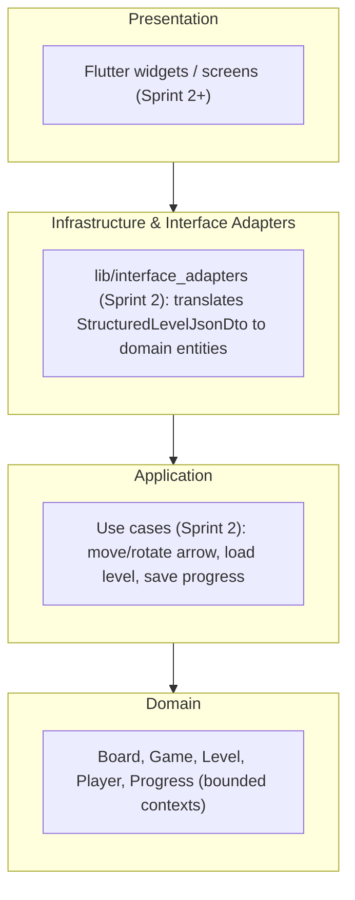

# Arrow Maze Escape Puzzle


## Description

*Arrow Maze Escape Puzzle* is a mobile puzzle game where the player extracts all the
arrows from a board by moving them in the direction they point, without colliding
with other arrows. Built with **Clean Architecture** and **SOLID** principles.

As of Sprint 1, the domain layer is complete and unified (see
[Sprint 1 status](#sprint-1-status) below) and the app boots to a placeholder screen.
Real screens, the 15 levels, audio and i18n are Sprint 2/3 work.

## Demo / Screenshots

_TBD — Sprint 2/3, once real screens (home, level select, gameplay, victory, defeat)
replace the current placeholder screen._

## Architecture

Four Clean Architecture layers, dependencies pointing inward (outer layers depend on
inner ones, never the reverse):



Source: [`docs/architecture/clean-architecture.mmd`](docs/architecture/clean-architecture.mmd)
(placeholder for Sprint 1 — will be refined by Sprint 3).

| Layer | Responsibility | Status |
|---|---|---|
| **Domain** | Entities, aggregates, value objects, domain services, events, repository ports | ✅ Implemented |
| Application | Use cases and orchestration | 🔜 Sprint 2 |
| Infrastructure / Interface Adapters | Local persistence, backend API client, DTO↔domain mapping | 🔜 Sprint 2 |
| Presentation | Flutter UI | 🔜 Sprint 2 |

### Domain layer

```
lib/domain/
├── shared/           # Cross-cutting value objects, enums and exceptions
├── player/           # Player and profile
├── board/            # Board, Cell, Arrow (state entities), domain events
├── level/            # Level (aggregate), JSON loading, star rating, generation presets
├── game/             # Game (active session aggregate): moves, pause/resume, score
├── progress/         # Player progress per level
└── repositories/     # Persistence contracts (interfaces)
```

### Aggregate roots

| Aggregate | Responsibility |
|---|---|
| **Level** | Level definition from JSON, initial board, optimal path |
| **Game** | Coordinates moves, pause/resume, score, win/loss and star rating during a session |
| **PlayerProfile** | Player profile and statistics |
| **PlayerProgress** | Progress and best stars per level |

### Level contract with the backend

Levels are loaded from the [BackEnd-ArrowMaze](https://github.com/Georopeza/BackEnd-ArrowMaze)
API using the shared `StructuredLevelJsonDto` contract (source of truth lives in the
backend repo, at `docs/contract/level.contract.ts`). The domain layer stays unaware of
this wire format: an adapter under `lib/interface_adapters` (Sprint 2) will translate
it into `Board`/`Arrow`/`Level` entities.

## Design Patterns

| Pattern | Category | Where |
|---|---|---|
| **Aggregate Root** | — (DDD) | `Level`, `Game`, `PlayerProfile`, `PlayerProgress` |
| **Value Object** | — (DDD) | `Position`, `Direction`, `StarRating`, `LevelBoardDefinition`, etc. |
| **Factory** | Creational | `LevelFactory`, `BoardFactory`, `CellFactory` |
| **Domain Service** | Behavioral | `ShortestPathCalculator`, `StarRatingCalculator`, `ArrowMovementEngine`, `CollisionValidator` |
| **Repository** | Structural (DIP) | Interfaces in `repositories/` |
| **Domain Event** | Behavioral | `GameWonEvent`, `ArrowExtractedEvent`, `ArrowBlockedEvent` (now actually raised via `Board.pullDomainEvents()`, ported in Sprint 1) |

## SOLID Principles

- **SRP** — `Board` only manages board state; `Game` coordinates session rules;
  `LevelFactory` only builds levels from JSON.
- **OCP** — new `Cell` subtypes or domain events can be added without changing
  `Board`/`Game`; `LevelGenerationConfig.fromDifficulty()` adds new difficulty presets
  without touching `LevelFactory`.
- **LSP** — every `Cell` subtype is substitutable wherever `Cell` is expected.
- **ISP** — repository ports (`IGameRepository`, `IPlayerProfileRepository`,
  `IPlayerProgressRepository`) are split by aggregate.
- **DIP** — `ArrowMovementEngine` depends on `ICollisionValidator`, not on a concrete
  validator; `LevelFactory` depends on `ShortestPathCalculator`/`BoardFactory` via
  constructor injection.

## AOP

Sprint 1 ports the first cross-cutting behavior into the domain: **domain events**.
`Board.withDomainEvent()` / `Board.pullDomainEvents()` let `ArrowMovementEngine` raise
`ArrowBlockedEvent`/`ArrowExtractedEvent` on every move, without `Game` or the future
UI layer having to compute them separately. Presentation-level cross-cutting concerns
(logging, error reporting) will be added in Sprint 2 once real screens exist.

## Getting Started

```bash
flutter pub get
flutter run          # or: flutter run -d chrome
```

## Running Tests

```bash
flutter analyze
flutter test
```

Current test suite (pure-Dart domain tests, `package:test`):
`test/domain/board/arrow_test.dart`, `test/domain/board/board_events_test.dart`,
`test/domain/game/game_test.dart`. CI (`.github/workflows/ci.yml`) runs
`pub get`, `analyze` and `test` on every PR/push to `main`.

## AI Usage Documentation

See [AI_USAGE.md](AI_USAGE.md) for the full log of AI-assisted tasks (tool, prompt,
result, team adjustments, lessons learned).

## Sprint 1 status

- ✅ Merged the two divergent domain branches (`Develop` + `Integracion`) into one
  English-named domain with a working Flutter app shell.
- ✅ Ported 6 behaviors that only existed in the Spanish domain: pause/resume, score,
  arrow reset, "no arrow at cell" move result, board domain events, difficulty-based
  generation presets.
- ✅ First AAA unit tests for the ported behaviors; CI running on every PR.
- 🔜 Sprint 2: use cases (movement/rotation with State + Factory patterns), interface
  adapters for the backend contract, and the first real screens.

## Contributing

1. Create a branch off `main` (e.g. `feature/<short-description>`).
2. Follow [Conventional Commits](https://www.conventionalcommits.org/) for commit
   messages (enforced via `commitlint`).
3. Run `flutter analyze && flutter test` before opening a PR.
4. Open a PR against `main`; CI must pass and at least one teammate must approve
   before merging.

## License

Academic project for Desarrollo de Software (UCAB). No license has been chosen yet;
all rights reserved by the team until one is added.
